<div align="center">

<!-- Animated Banner -->


<br/>

<!-- Animated Typing Effect Badge -->
[](https://git.io/typing-svg)

<br/>

<!-- Tech Stack Badges -->
[](https://flutter.dev)
[](https://www.djangoproject.com/)
[](https://www.postgresql.org/)
[](https://www.django-rest-framework.org/)
[](LICENSE)

<br/>

<!-- Quick Stats -->


<br/>

> ### 🏛️ A production-ready complaint management platform for universities
> Empowering students to raise concerns · Enabling departments to resolve them efficiently · Providing Super Admin with complete system oversight

<br/>

[📱 Features](#-features) · [🖼️ Screenshots](#-screenshots) · [🏗️ Architecture](#️-architecture) · [🚀 Quick Start](#-quick-start) · [📋 API Docs](#-api-endpoints) · [👨‍💻 Author](#-author)

</div>

---

## 📊 Portal Status

<div align="center">

| Portal | Status | Description |
|:------:|:------:|:-----------:|
| 🎓 Student Portal |  | Submit, track, and manage complaints |
| 🛡️ Admin Portal |  | Role-based complaint management |
| 👑 Super Admin |  | Analytics dashboard & system oversight |
| 🏠 Warden Portal |  | Hostel & infrastructure complaints |
| 📝 Examination Portal |  | Exam-related issues |
| 💰 Treasury Portal |  | Fee & financial complaints |
| 🔒 Security Portal |  | Campus security issues |
| 🚌 Transport Portal |  | Transport complaints |
| 📚 Library Portal |  | Library-related issues |
| 🏋️ Sports Portal |  | Sports facility complaints |
| 💻 IT Portal |  | Lab & IT support issues |

</div>

---

## 🌟 Features

<details>
<summary><b>👨‍🎓 Student Portal</b> — click to expand</summary>
<br/>

| Feature | Details |
|---------|---------|
| 🔐 **Secure Auth** | Register & login using university roll number |
| 📝 **Submit Complaints** | Title, description, department selection, and file attachments |
| 🏢 **10 Departments** | Route complaints to the right authority automatically |
| 📍 **Real-Time Tracking** | Live status updates — Pending / Resolved / Rejected |
| 📎 **File Attachments** | Upload images, PDFs, or documents as supporting evidence |
| 🔔 **Notifications** | Instant in-app alerts on complaint status changes |
| 📜 **Complaint History** | Full history with timestamps and resolution details |
| 🖼️ **Profile Picture** | Upload and update profile picture during registration or from profile |
| ⭐ **Admin Rating** | Rate admin performance (1-5 stars) after complaint resolution |

</details>

<details>
<summary><b>👨‍💼 Admin Portal</b> — click to expand</summary>
<br/>

| Feature | Details |
|---------|---------|
| 🗂️ **Role-Based Access** | Each department has its own isolated complaint queue |
| ✅ **Resolve / ❌ Reject** | One-click resolution or rejection with mandatory remarks |
| 📊 **Live Dashboard** | Real-time counters — Total / Pending / Resolved / Rejected |
| 🔍 **Search & Filter** | Find complaints by ID, title, student name, or type |
| 🔔 **Auto-Notifications** | Students are automatically notified on any status change |
| 👤 **Profile Management** | View, manage, and update department admin profile picture |
| ⭐ **Performance Ratings** | View ratings received from students |

</details>

<details>
<summary><b>👑 Super Admin Dashboard</b> — click to expand</summary>
<br/>

| Feature | Details |
|---------|---------|
| 📈 **Analytics Dashboard** | Interactive graphs and charts for complaint statistics |
| 📊 **Overall Statistics** | Total, Pending, Resolved, Rejected counts across all departments |
| 🏢 **Department Analytics** | Department-wise complaint breakdown with performance metrics |
| 📉 **Daily Trends** | 30-day time-series visualization of complaint activity |
| ⚠️ **Escalation Management** | View and manage complaints escalated due to delays |
| 🔄 **Reassign Complaints** | Reassign escalated complaints to different departments |
| ⭐ **Admin Ratings Overview** | View aggregated admin performance ratings |
| 📋 **Rating Details** | See individual student feedback and ratings per complaint |

</details>

<details>
<summary><b>⚡ Automatic Escalation System</b> — click to expand</summary>
<br/>

| Feature | Details |
|---------|---------|
| ⏰ **Auto-Escalation** | Complaints pending for 2+ days are automatically escalated to Super Admin |
| 📢 **Student Notification** | Students are notified when their complaint is escalated |
| 🔧 **Configurable Threshold** | Escalation time threshold can be configured (default: 2 days) |
| 🔄 **Reassignment** | Super Admin can reassign escalated complaints to appropriate departments |
| ✅ **Direct Resolution** | Super Admin can resolve escalated complaints directly |

</details>

<details>
<summary><b>⭐ Admin Rating System</b> — click to expand</summary>
<br/>

| Feature | Details |
|---------|---------|
| ⭐ **5-Star Rating** | Students rate admin performance after complaint resolution |
| 📝 **Optional Comments** | Students can provide detailed feedback |
| 📊 **Rating Criteria** | Rate based on Resolution Quality, Response Time, and Professionalism |
| 👑 **Super Admin Visibility** | All ratings visible to Super Admin for performance evaluation |
| 📈 **Performance Analytics** | Average rating per department calculated automatically |

</details>

---

## 🖼️ Screenshots

### 👨‍🎓 Student Portal

<table>
<tr>
<td align="center" width="25%">

**📋 Student Profile**

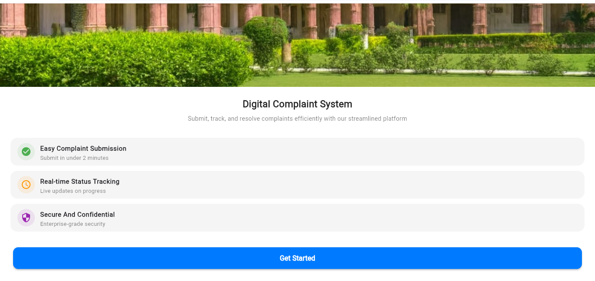

*Profile & Dashboard*

</td>
<td align="center" width="25%">

**📝 Submit Complaint**

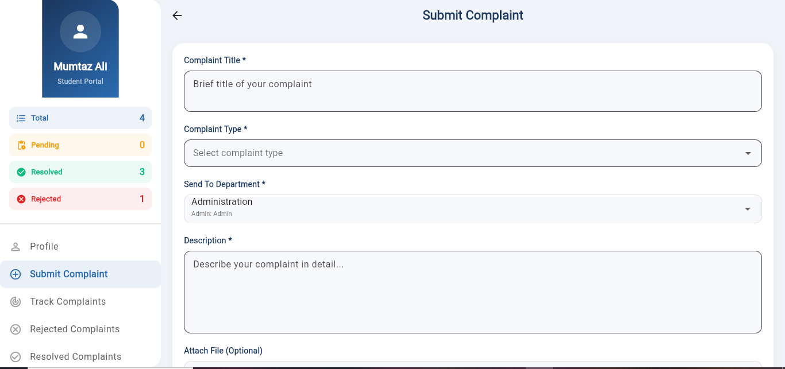

*Complaint Submission Form*

</td>
<td align="center" width="25%">

**🔎 Track Complaints**

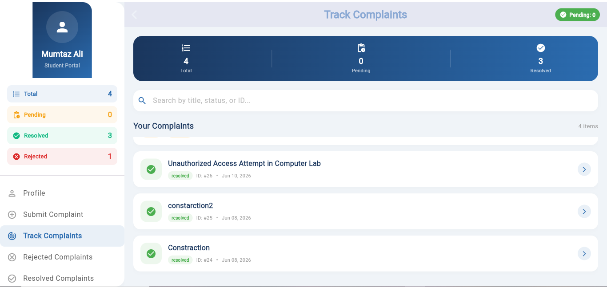

*Real-Time Tracking*

</td>
<td align="center" width="25%">

**✅ Resolved Complaints**

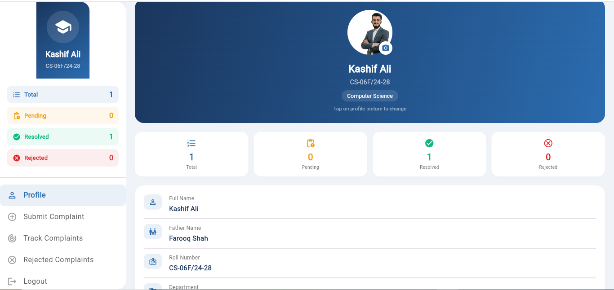

*Resolution History*

</td>
</tr>
<tr>
<td align="center" width="25%">

**📄 Complaint Detail**

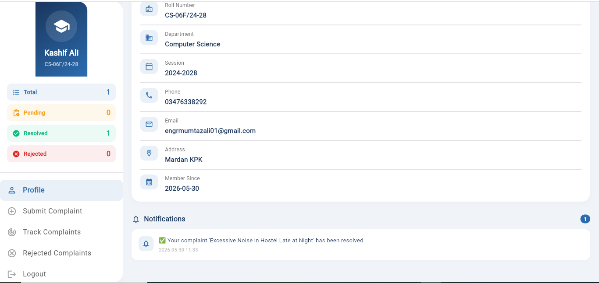

*Resolved Complaint Detail View*

</td>
<td align="center" width="25%">

**❌ Rejected Complaints**

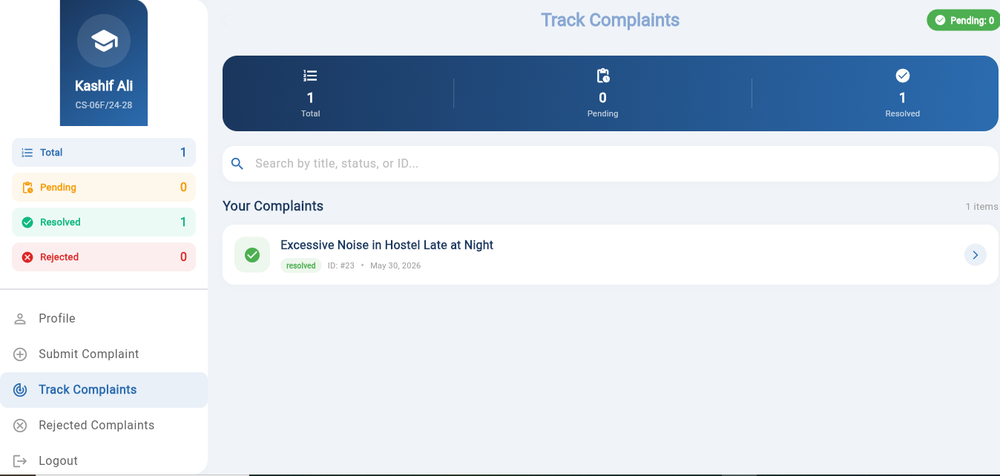

*Rejection Reason & Details*

</td>
<td align="center" width="25%">

**⭐ Rate Admin**

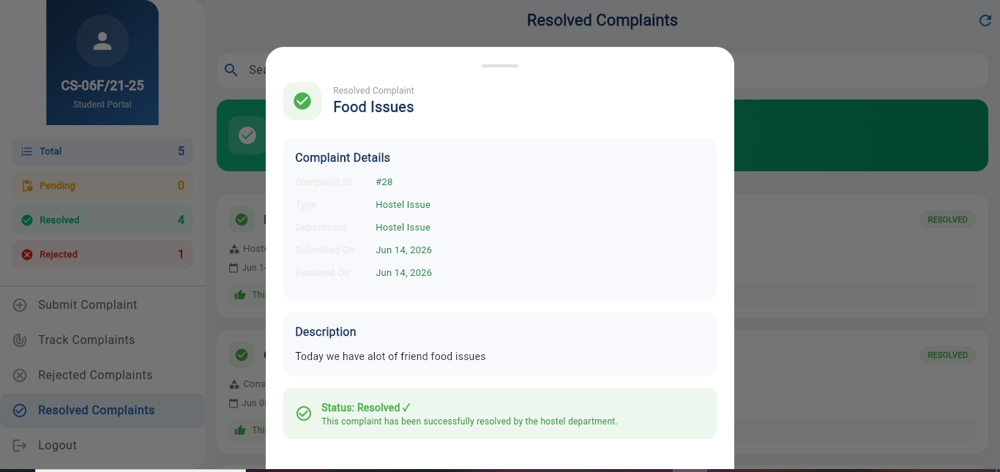

*5-Star Rating System*

</td>
<td align="center" width="25%">

</td>
</tr>
</table>

---

### 🛡️ Admin Portal

<table>
<tr>
<td align="center" width="25%">

**📊 All Complaints**

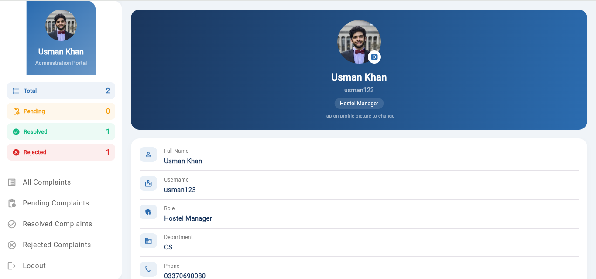

*Dashboard — All Complaints*

</td>
<td align="center" width="25%">

**🔔 Notifications**

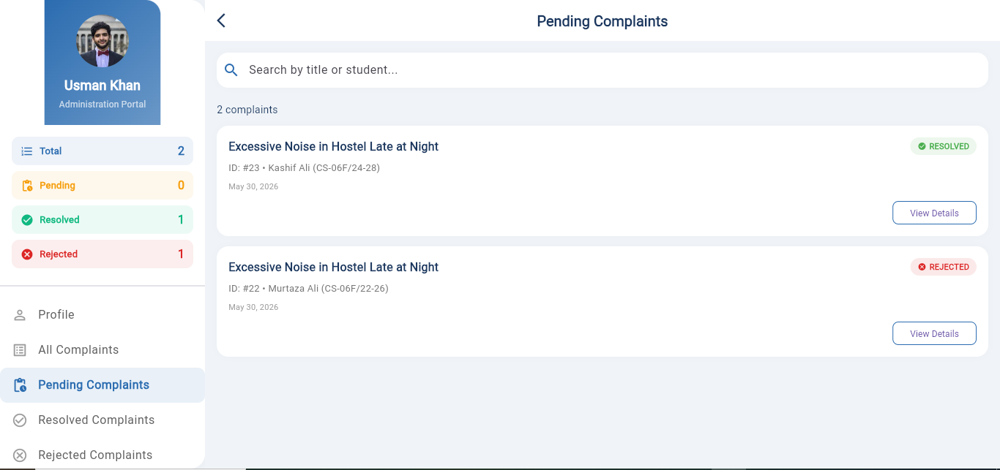

*Real-Time Notification Feed*

</td>
<td align="center" width="25%">

**⏳ Pending Queue**

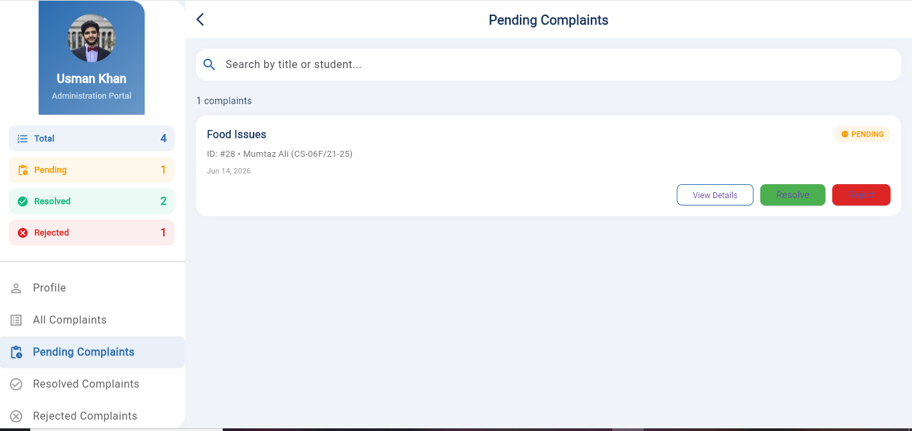

*Pending Complaints*

</td>
<td align="center" width="25%">

**✅ Resolved View**

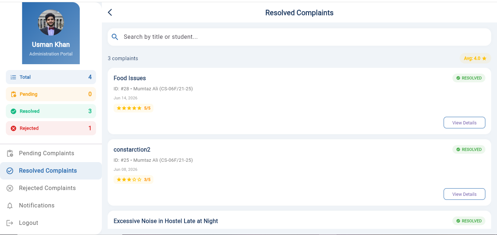

*Resolved + Star Ratings*

</td>
</tr>
</table>

---

### 👑 Super Admin Dashboard

<table>
<tr>
<td align="center" width="33%">

**📈 Department Analytics**

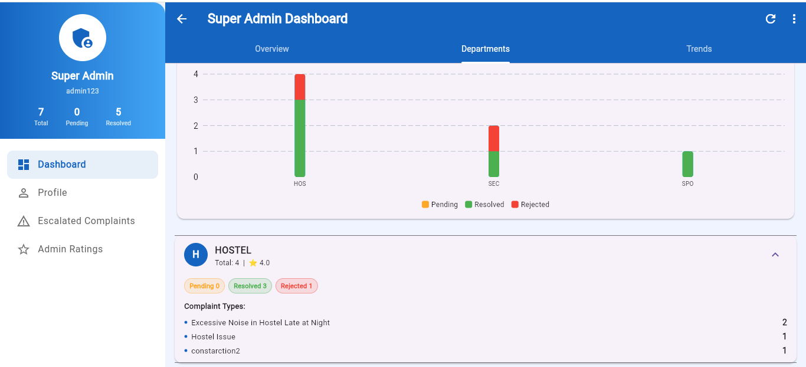

*System-Wide Stats & Charts*

</td>
<td align="center" width="33%">

**👤 Super Admin Profile**

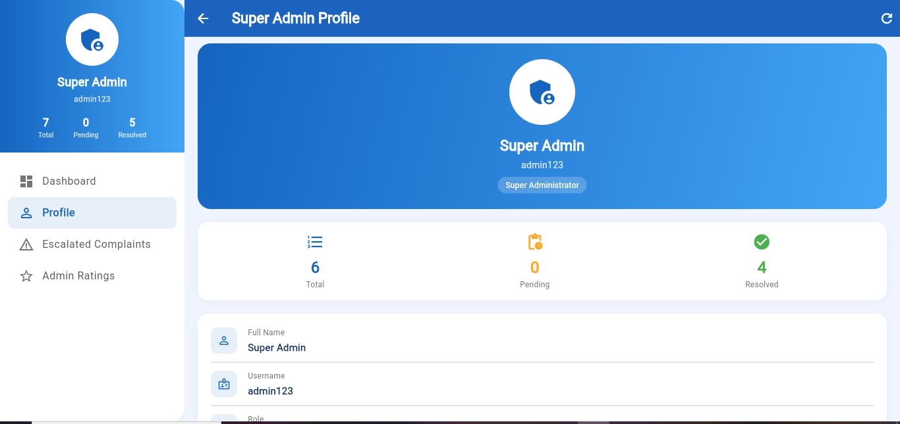

*Profile & System Overview*

</td>
<td align="center" width="33%">

**⭐ Admin Ratings**

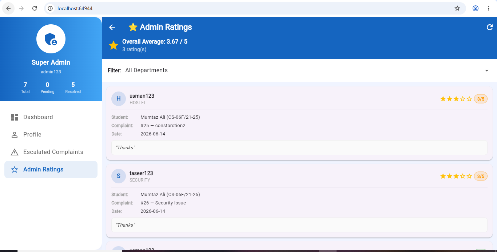

*Ratings Leaderboard*

</td>
</tr>
</table>

---
## 🏗️ Architecture

```
┌──────────────────────────────────────────────────────────────┐
│                      Flutter Frontend                        │
│       Student Portal · Admin Portal · Super Admin Dashboard  │
└─────────────────────────┬────────────────────────────────────┘
                          │ HTTP / REST
                          ▼
┌──────────────────────────────────────────────────────────────┐
│                    Django REST API                           │
│     Authentication · CRUD · Signals · File Uploads          │
│     Auto-Escalation · Rating System · Analytics             │
└─────────────────────────┬────────────────────────────────────┘
                          │ psycopg2
                          ▼
┌──────────────────────────────────────────────────────────────┐
│                   PostgreSQL Database                        │
│   Students · Complaints · AdminProfiles · Notifications      │
│   EscalationLog · AdminRating · SuperAdmin                   │
└──────────────────────────────────────────────────────────────┘
```

---

## 🔐 Multi-Role Admin System

<div align="center">

| Role | Department | Handles |
|------|------------|---------|
| `administration` | Administration | General university complaints |
| `warden` | Warden | Hostel & infrastructure |
| `examination` | Examination | Exam-related issues |
| `treasury` | Treasury | Fee & financial matters |
| `security` | Security | Campus security concerns |
| `transport` | Transport | Bus & transport issues |
| `library` | Library | Library access & resources |
| `hostel` | Hostel | Hostel facilities |
| `sports` | Sports | Sports facilities |
| `it` | IT Department | Lab & IT support |

</div>

> 🔒 Each admin account only sees complaints directed to their department — **full role isolation**.

---

## 🛠️ Tech Stack

<div align="center">

### Frontend
| Technology | Version | Purpose |
|------------|---------|---------|
|  Flutter | 3.27.0 | Cross-platform UI framework |
|  Dart | 3.9.2 | Programming language |
| `http` | 1.1.0 | REST API communication |
| `file_picker` | 8.0.0 | File upload support (Web & Mobile) |
| `shared_preferences` | 2.5.5 | Local storage for user sessions |
| `fl_chart` | 0.68.0 | Charts and graphs for analytics |

### Backend
| Technology | Version | Purpose |
|------------|---------|---------|
|  Python | 3.14+ | Server-side language |
|  Django | 6.0.5 | Web framework |
|  DRF | 3.17.1 | API layer |
|  PostgreSQL | 18.4 | Primary database |
| `psycopg2-binary` | Latest | PostgreSQL adapter |
| `django-cors-headers` | Latest | CORS handling |

</div>

---

## 📋 API Endpoints

<details>
<summary><b>🎓 Student Endpoints</b></summary>
<br/>

| Method | Endpoint | Description |
|--------|----------|-------------|
| `POST` | `/api/student/login/` | Student authentication |
| `POST` | `/api/student/register/` | New student registration |
| `GET` | `/api/student/dashboard/<student_id>/` | Dashboard data + stats + notifications |
| `POST` | `/api/student/complaint/submit/` | Submit a complaint (supports file upload) |
| `GET` | `/api/student/complaint/track/<student_id>/` | Track all complaints |
| `GET` | `/api/student/complaint/<student_id>/<complaint_id>/` | Complaint detail view |
| `GET` | `/api/student/profile/<student_id>/` | Get student profile with stats |
| `POST` | `/api/student/upload-profile-pic/` | Upload student profile picture |
| `POST` | `/api/student/rate-admin/<complaint_id>/` | Rate admin performance |

</details>

<details>
<summary><b>🛡️ Admin Endpoints</b></summary>
<br/>

| Method | Endpoint | Description |
|--------|----------|-------------|
| `POST` | `/api/admin/login/` | Admin authentication |
| `POST` | `/api/admin/register/` | Admin account creation |
| `GET` | `/api/admin/complaints/<admin_type>/` | Role-specific complaint queue |
| `GET` | `/api/admin/complaint/pending/` | All pending complaints |
| `GET` | `/api/admin/complaint/solved/` | All resolved complaints |
| `GET` | `/api/admin/complaint/rejected/` | All rejected complaints |
| `PATCH` | `/api/admin/complaint/update-status/<id>/` | Update complaint status |
| `POST` | `/api/admin/complaint/reject/<id>/` | Reject with remarks |
| `GET` | `/api/admin/notifications/` | Admin notifications |
| `GET` | `/api/admin/profile/<admin_id>/` | Get admin profile |
| `POST` | `/api/admin/upload-profile-pic/` | Upload admin profile picture |

</details>

<details>
<summary><b>👑 Super Admin Endpoints</b></summary>
<br/>

| Method | Endpoint | Description |
|--------|----------|-------------|
| `POST` | `/api/super-admin/login/` | Super Admin authentication |
| `GET` | `/api/super-admin/stats/` | Comprehensive analytics dashboard data |
| `GET` | `/api/super-admin/escalated/` | Get all escalated complaints |
| `POST` | `/api/super-admin/reassign/<id>/` | Reassign escalated complaint |
| `POST` | `/api/super-admin/resolve/<id>/` | Resolve escalated complaint |
| `GET` | `/api/super-admin/admin-ratings/` | Get all admin ratings |

</details>

---

## 🚀 Quick Start

### Prerequisites


---

### ⚙️ Backend Setup

```bash
# 1. Clone the repository
git clone https://github.com/engrmumtazali0112/Student-Complaint-Management-System.git
cd Student-Complaint-Management-System/backend

# 2. Create & activate virtual environment
python -m venv venv

# Windows
.\venv\Scripts\Activate.ps1

# macOS / Linux
source venv/bin/activate

# 3. Install dependencies
pip install -r requirements.txt
```

**4. Configure PostgreSQL** — create a database and update `config/settings.py`:

```python
DATABASES = {
    'default': {
        'ENGINE': 'django.db.backends.postgresql',
        'NAME': 'fyp_db',
        'USER': 'postgres',
        'PASSWORD': 'your_password',
        'HOST': 'localhost',
        'PORT': '5432',
    }
}
```

```bash
# 5. Apply migrations
python manage.py makemigrations
python manage.py migrate

# 6. Create Django superuser
python manage.py createsuperuser

# 7. Start backend server
python manage.py runserver
```

---

### 📱 Frontend Setup

```bash
# Navigate to the Flutter project
cd ../frontend

# Install dependencies
flutter pub get

# Run in browser
flutter run -d chrome

# Run on connected device
flutter run
```

---

### 👤 Seed Admin Accounts

Run once to create all department admin users:

```bash
python manage.py shell
```

```python
from django.contrib.auth.models import User
from api.models import AdminProfile, SuperAdmin

admins = [
    ('admin',     'admin123',     'Administration', 'administration'),
    ('warden',    'warden123',    'Warden',         'warden'),
    ('exam',      'exam123',      'Examination',    'examination'),
    ('treasury',  'treasury123',  'Treasury',       'treasury'),
    ('security',  'security123',  'Security',       'security'),
    ('transport', 'transport123', 'Transport',      'transport'),
    ('library',   'library123',   'Library',        'library'),
    ('hostel',    'hostel123',    'Hostel',         'hostel'),
    ('sports',    'sports123',    'Sports',         'sports'),
    ('it',        'it123',        'IT Department',  'it'),
]

for username, password, name, role in admins:
    user = User.objects.create_user(username=username, password=password, first_name=name, is_staff=True)
    AdminProfile.objects.create(user=user, role=role)
    print(f"✅ Created {role}: {username}")

# Create Super Admin
super_admin_user = User.objects.create_user(
    username='superadmin',
    password='superadmin123',
    is_staff=True,
    is_superuser=True
)
SuperAdmin.objects.create(user=super_admin_user)
print("✅ Created Super Admin: superadmin")
```

---

### ⚙️ Auto-Escalation Setup

**Run Manually:**
```bash
python manage.py escalate_complaints --threshold 2
```

**Schedule with Cron (Linux/macOS):**
```bash
# Run every 6 hours
0 */6 * * * cd /path/to/backend && python manage.py escalate_complaints
```

**Schedule with Task Scheduler (Windows):**
```powershell
schtasks /create /tn "EscalateComplaints" /tr "python D:\path\to\backend\manage.py escalate_complaints" /sc hourly /mo 6
```

---

## 📁 Project Structure

```
Student-Complaint-Management-System/
│
├── 📂 backend/
│   ├── 📂 config/
│   │   ├── settings.py          # Django configuration
│   │   └── urls.py              # Root URL routing
│   │
│   └── 📂 api/
│       ├── models.py            # Student, Complaint, AdminProfile, Notification
│       ├── views.py             # All API view logic
│       ├── urls.py              # API URL patterns
│       ├── serializers.py       # DRF serializers
│       ├── signals.py           # Auto-notification on complaint updates
│       └── 📂 management/
│           └── 📂 commands/
│               └── escalate_complaints.py
│
├── 📂 frontend/
│   ├── 📂 lib/
│   │   ├── 📂 constants/
│   │   │   └── api_constants.dart
│   │   └── 📂 screens/
│   │       ├── 📂 student/      # Student portal screens
│   │       ├── 📂 admin/        # Admin portal screens
│   │       ├── 📂 super_admin/  # Super Admin screens
│   │       └── 📂 shared/       # Shared screens
│   └── pubspec.yaml
│
└── 📂 demo/                     # 📸 Demo screenshots
```

---

## 🗄️ Database Schema

<details>
<summary><b>Student</b></summary>

| Field | Type | Notes |
|-------|------|-------|
| `student_id` | CharField(20) | Unique; format CS-06F/22-26 |
| `name` | CharField(100) | Full name |
| `father_name` | CharField(100) | Father's name |
| `department` | CharField(100) | Academic department |
| `session` | CharField(50) | Academic session |
| `profile_picture` | ImageField | Optional profile photo |
| `user` | OneToOneField(User) | Linked Django auth user |

</details>

<details>
<summary><b>Complaint</b></summary>

| Field | Type | Notes |
|-------|------|-------|
| `student` | ForeignKey(Student) | Complaint owner |
| `title` | CharField(200) | Short title |
| `complaint_type` | CharField(100) | Category |
| `admin_type` | CharField(20) | Target department (10 choices) |
| `description` | TextField | Full complaint body |
| `status` | CharField(20) | pending / resolved / rejected |
| `attachment` | FileField | Optional supporting file |
| `rejection_remarks` | TextField | Required when rejecting |
| `created_at` | DateTimeField | Auto-set on creation |
| `resolved_at` | DateTimeField | Set on resolution |

</details>

<details>
<summary><b>AdminProfile</b></summary>

| Field | Type | Notes |
|-------|------|-------|
| `user` | OneToOneField(User) | Linked Django auth user |
| `role` | CharField(20) | One of 10 AdminRole choices |
| `phone` | CharField(15) | Optional contact number |
| `department` | CharField(100) | Department label |
| `profile_picture` | ImageField | Optional profile photo |

</details>

<details>
<summary><b>SuperAdmin · EscalationLog · AdminRating</b></summary>

**SuperAdmin**

| Field | Type | Notes |
|-------|------|-------|
| `user` | OneToOneField(User) | Linked Django auth user |
| `created_at` | DateTimeField | Auto-set on creation |

**EscalationLog**

| Field | Type | Notes |
|-------|------|-------|
| `complaint` | ForeignKey(Complaint) | Escalated complaint |
| `escalated_at` | DateTimeField | When escalation occurred |
| `reason` | CharField(255) | Reason for escalation |
| `is_resolved_by_super_admin` | BooleanField | Whether Super Admin resolved it |

**AdminRating**

| Field | Type | Notes |
|-------|------|-------|
| `complaint` | OneToOneField(Complaint) | Rated complaint |
| `admin` | ForeignKey(AdminProfile) | Admin being rated |
| `student` | ForeignKey(Student) | Student who rated |
| `rating` | IntegerField | 1-5 star rating |
| `comment` | TextField | Optional feedback |
| `created_at` | DateTimeField | When rating was submitted |

</details>

---

## 🤝 Contributing

Contributions are very welcome!

```bash
# 1. Fork the repo and clone your fork
git clone https://github.com/YOUR_USERNAME/Student-Complaint-Management-System.git

# 2. Create a feature branch
git checkout -b feature/your-feature-name

# 3. Make your changes and commit
git commit -m "feat: add your feature description"

# 4. Push and open a Pull Request
git push origin feature/your-feature-name
```

> Please follow [Conventional Commits](https://www.conventionalcommits.org/) and ensure your code passes all existing tests before submitting.

---

## 📄 License

Distributed under the **MIT License**. See [`LICENSE`](LICENSE) for full details.

---

## 👨‍💻 Author

<div align="center">

### Mumtaz Ali

[](https://github.com/engrmumtazali0112)
[](https://linkedin.com/in/mumtazali)
[](mailto:engrmumtazali0112@gmail.com)

</div>

---

## 🙏 Acknowledgments

- [**Flutter**](https://flutter.dev) — for the beautiful cross-platform UI framework
- [**Django**](https://www.djangoproject.com/) — for the robust and scalable backend
- [**Django REST Framework**](https://www.django-rest-framework.org/) — for the clean API layer
- [**PostgreSQL**](https://www.postgresql.org/) — for reliable and performant data storage
- [**fl_chart**](https://pub.dev/packages/fl_chart) — for beautiful chart visualizations

---

<div align="center">

⭐ **If this project helped you, please give it a star on GitHub!**


*Made with ❤️ by [Mumtaz Ali](https://github.com/engrmumtazali0112)*

</div>